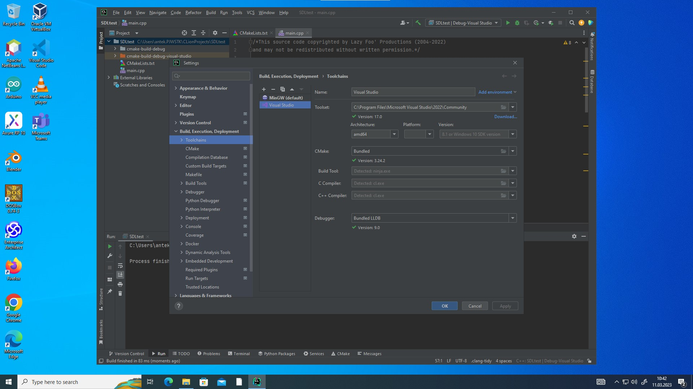
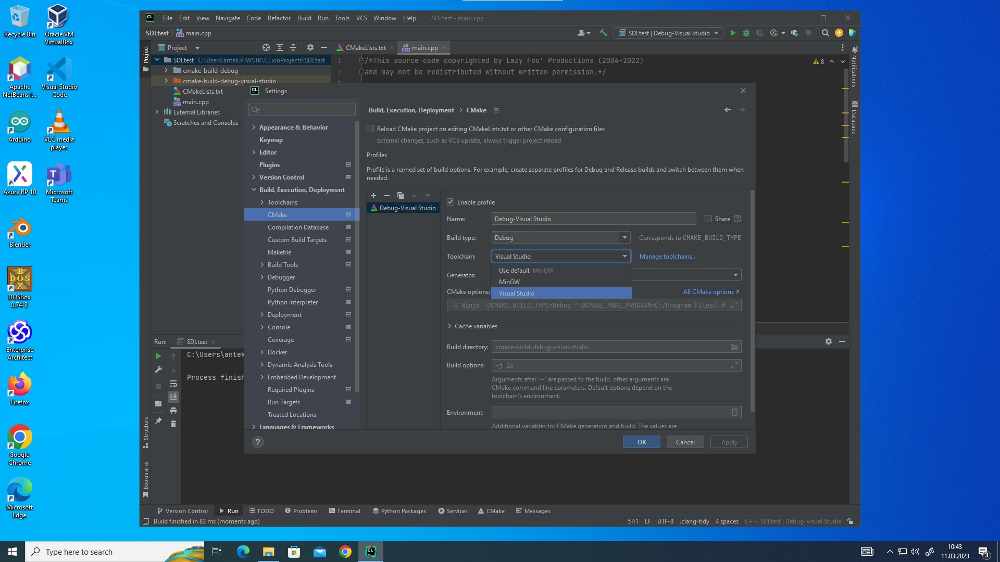
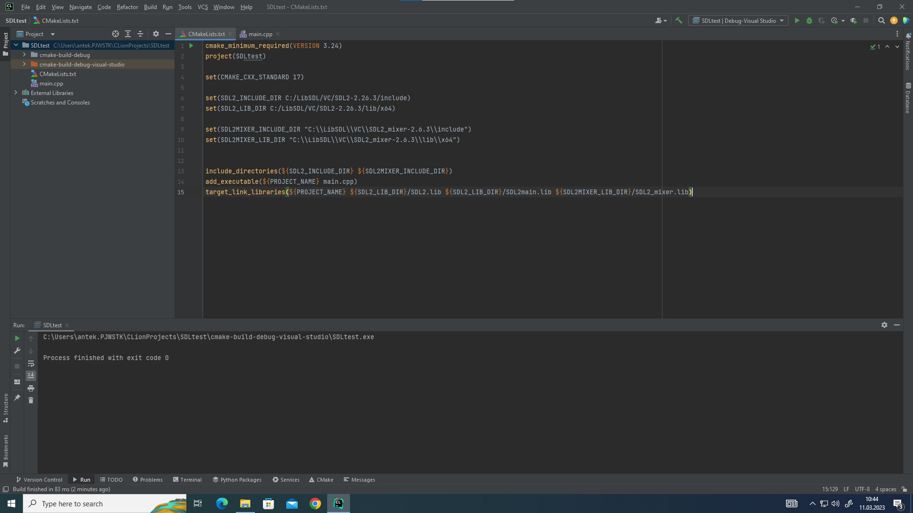
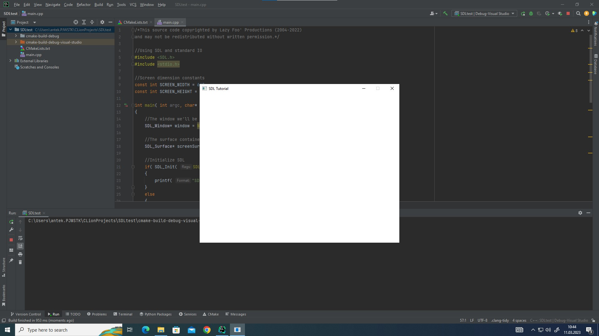

# Instrukcja na pracowni


Dzięki naszemu adminowi, mamy taką instrukcję:


Zastosuj CMakeLists.txt do Swojego projektu. Instrukcja obrazkowa:




W Toolchains należy zmienić architekturę VisualStudio na 64 bitową (np. amd64)



W konfiguracji CMake należy wybrać Toolchain Visual Studio

Użyć CMakeLists 






UWAGA: Czasami trzeba będzie dodać:

```c++
#define SDL_MAIN_HANDLED
```
